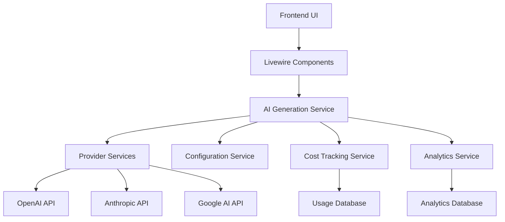

# AI Integration Guide

> Version: 1.0.0
> Last Updated: September 2, 2025

## Overview

The Project Namer application includes a comprehensive AI integration system that enables intelligent business name generation using multiple AI providers. This guide covers architecture, usage patterns, configuration, and best practices for working with the AI system.

## Table of Contents

1. [Architecture Overview](#architecture-overview)
2. [Core Services](#core-services)
3. [Configuration](#configuration)
4. [Usage Patterns](#usage-patterns)
5. [Frontend Integration](#frontend-integration)
6. [Analytics & Monitoring](#analytics--monitoring)
7. [Security & Compliance](#security--compliance)
8. [Performance Optimization](#performance-optimization)
9. [Troubleshooting](#troubleshooting)
10. [API Reference](#api-reference)

## Architecture Overview

The AI integration system is built with a modular, service-oriented architecture that provides:

- **Multi-provider support** (OpenAI, Anthropic, Google, etc.)
- **Intelligent fallback mechanisms**
- **Cost tracking and budget management**
- **Comprehensive analytics and monitoring**
- **Accessibility-first design**
- **Performance optimization with caching**

### System Components



## Core Services

### AIGenerationService

The main service that orchestrates AI name generation.

```php
use App\Services\AIGenerationService;

$service = app(AIGenerationService::class);

$result = $service->generateNames([
    'business_description' => 'A modern tech startup...',
    'industry' => 'technology',
    'style' => 'creative',
    'model' => 'openai-gpt-4',
]);
```

**Key Methods:**
- `generateNames(array $request): array` - Generate business names
- `getAvailableModels(): array` - Get available AI models
- `estimateCost(array $request): float` - Estimate generation cost

### AIConfigurationService

Manages AI model configurations and system settings.

```php
use App\Services\AI\AIConfigurationService;

$config = app(AIConfigurationService::class);

// Get available models
$models = $config->getAvailableModels();

// Update model configuration
$config->updateModelConfig('openai-gpt-4', [
    'enabled' => true,
    'max_tokens' => 150,
    'temperature' => 0.7,
]);

// Check system maintenance mode
$isInMaintenance = $config->isInMaintenanceMode();
```

### AICostTrackingService

Tracks usage costs and manages budget limits.

```php
use App\Services\AI\AICostTrackingService;

$costTracker = app(AICostTrackingService::class);

// Record API usage
$cost = $costTracker->recordUsage(
    $user,
    'openai-gpt-4',
    100, // input tokens
    50,  // output tokens
    2.5, // response time
    true // successful
);

// Check user limits
$limits = $costTracker->checkUserLimits($user);

// Get system cost statistics
$stats = $costTracker->getSystemCostStats('day');
```

### AIAnalyticsService

Provides comprehensive analytics and reporting.

```php
use App\Services\AI\AIAnalyticsService;

$analytics = app(AIAnalyticsService::class);

// Get user analytics
$userStats = $analytics->getUserAnalytics($user, 'month');

// Get system-wide analytics
$systemStats = $analytics->getSystemAnalytics('week');

// Get real-time metrics (admin only)
$realTime = $analytics->getRealTimeMetrics();
```

### AIAccessibilityService

Handles accessibility features and WCAG compliance.

```php
use App\Services\AI\AIAccessibilityService;

$accessibility = app(AIAccessibilityService::class);

// Generate screen reader announcements
$announcement = $accessibility->generateProgressAnnouncement(
    'processing',
    75,
    'GPT-4'
);

// Get element accessibility attributes
$attributes = $accessibility->getElementAttributes('model_card', [
    'selected' => true,
    'description_id' => 'model-desc-1',
]);
```

## Configuration

### Environment Variables

Add these to your `.env` file:

```env
# AI Model Availability
AI_GPT4_ENABLED=true
AI_GPT35_ENABLED=true
AI_CLAUDE_ENABLED=false
AI_GEMINI_ENABLED=false

# Default Models
AI_DEFAULT_MODEL=openai-gpt-4
AI_FALLBACK_MODEL=openai-gpt-3.5-turbo

# Usage Limits
AI_MAX_GENERATIONS_PER_HOUR=50
AI_MAX_GENERATIONS_PER_DAY=200

# System Features
AI_ENABLE_ANALYTICS=true
AI_ENABLE_CACHING=true
AI_ENABLE_COST_TRACKING=true

# Performance Settings
AI_CACHE_TTL_MINUTES=60
AI_TIMEOUT_SECONDS=30
AI_RETRY_ATTEMPTS=3

# Cost Tracking
AI_COST_TRACKING_ENABLED=true
AI_DAILY_BUDGET_LIMIT=100.00
AI_MONTHLY_BUDGET_LIMIT=2000.00
AI_COST_ALERT_THRESHOLD=80

# Analytics
AI_ANALYTICS_ENABLED=true
AI_ANALYTICS_RETENTION_DAYS=90
AI_TRACK_USER_BEHAVIOR=true

# Security
AI_GLOBAL_RATE_LIMIT=1000
AI_USER_RATE_LIMIT=20
AI_LOG_API_REQUESTS=true

# API Keys (required for each enabled provider)
OPENAI_API_KEY=your_openai_key_here
ANTHROPIC_API_KEY=your_anthropic_key_here
GOOGLE_AI_API_KEY=your_google_key_here
```

### Configuration File

The `config/ai.php` file contains detailed configuration options:

```php
return [
    'models' => [
        'openai-gpt-4' => [
            'name' => 'GPT-4',
            'provider' => 'openai',
            'model_id' => 'gpt-4',
            'enabled' => env('AI_GPT4_ENABLED', true),
            'max_tokens' => 150,
            'temperature' => 0.7,
            'cost_per_1k_tokens' => 0.03,
            // ... more configuration
        ],
        // ... other models
    ],
    
    'settings' => [
        'default_model' => env('AI_DEFAULT_MODEL', 'openai-gpt-4'),
        'max_generations_per_user_per_hour' => (int) env('AI_MAX_GENERATIONS_PER_HOUR', 50),
        // ... more settings
    ],
    
    // ... provider configurations, cost tracking, etc.
];
```

## Usage Patterns

### Basic Name Generation

```php
// In a Livewire component
class NameGeneratorDashboard extends Component
{
    public function generateNames()
    {
        $service = app(AIGenerationService::class);
        
        try {
            $results = $service->generateNames([
                'business_description' => $this->businessDescription,
                'industry' => $this->selectedIndustry,
                'style' => $this->generationMode,
                'model' => $this->selectedModel,
                'user' => auth()->user(),
            ]);
            
            $this->results = $results['suggestions'];
            $this->generationCost = $results['cost'];
            
        } catch (\Exception $e) {
            $this->dispatch('show-toast', [
                'message' => 'Generation failed: ' . $e->getMessage(),
                'type' => 'error',
            ]);
        }
    }
}
```

### Model Selection with Availability Check

```php
public function selectModel(string $modelId)
{
    $config = app(AIConfigurationService::class);
    
    if (!$config->isModelAvailable($modelId)) {
        $status = $config->getModelStatus($modelId);
        $this->dispatch('show-toast', [
            'message' => "Model unavailable: {$status}",
            'type' => 'warning',
        ]);
        return;
    }
    
    $this->selectedModel = $modelId;
    $this->dispatch('model-selected', $modelId);
}
```

### Cost Estimation Before Generation

```php
public function estimateGenerationCost()
{
    $service = app(AIGenerationService::class);
    
    $estimation = $service->estimateCost([
        'business_description' => $this->businessDescription,
        'model' => $this->selectedModel,
    ]);
    
    $this->estimatedCost = $estimation['estimated_cost'];
    
    // Check if user can afford this generation
    $costTracker = app(AICostTrackingService::class);
    $limits = $costTracker->checkUserLimits(auth()->user());
    
    if ($limits['hourly']['exceeded'] || $limits['daily']['exceeded']) {
        $this->showLimitExceededMessage($limits);
    }
}
```

### Error Handling and Fallbacks

```php
public function generateWithFallback()
{
    $service = app(AIGenerationService::class);
    $config = app(AIConfigurationService::class);
    
    $primaryModel = $this->selectedModel;
    $fallbackModel = $config->getSystemSettings()['fallback_model'];
    
    try {
        return $service->generateNames([
            'model' => $primaryModel,
            // ... other parameters
        ]);
        
    } catch (ModelUnavailableException $e) {
        // Try fallback model
        if ($config->isModelAvailable($fallbackModel)) {
            return $service->generateNames([
                'model' => $fallbackModel,
                // ... other parameters
            ]);
        }
        
        throw new \RuntimeException('No AI models available');
    }
}
```

## Frontend Integration

### Livewire Components

#### Name Generator Dashboard

```blade
<div class="ai-interface" wire:poll.5s="refreshProgress">
    <!-- Model Selection -->
    <x-ai.accessible-model-selector 
        :models="$availableModels"
        :selectedModel="$selectedModel"
        onModelSelect="selectModel"
        :disabled="$generating" />
    
    <!-- Input Form -->
    <form wire:submit.prevent="generateNames">
        <x-ai.accessible-input
            wire:model.live="businessDescription"
            label="Business Description"
            :maxLength="2000"
            :required="true" />
        
        <button type="submit" :disabled="$generating">
            {{ $generating ? 'Generating...' : 'Generate Names' }}
        </button>
    </form>
    
    <!-- Results -->
    @if($results)
        <x-ai.accessible-results-list 
            :results="$results"
            :loading="$generating" />
    @endif
</div>
```

#### Admin Configuration Manager

```blade
<div class="admin-ai-config">
    <!-- Model Configuration -->
    <x-ai.model-config-table 
        :models="$models"
        wire:model="editingModel" />
    
    <!-- System Settings -->
    <x-ai.system-settings-panel 
        :settings="$systemSettings"
        wire:model="settings" />
    
    <!-- Performance Metrics -->
    <x-ai.performance-dashboard 
        :metrics="$performanceMetrics" />
</div>
```

### JavaScript Integration

```javascript
// AI Generation Progress Tracking
document.addEventListener('livewire:init', () => {
    Livewire.on('ai-generation-started', (data) => {
        showProgressBar(data.modelName);
        announceToScreenReader(`Generation started with ${data.modelName}`);
    });
    
    Livewire.on('ai-generation-progress', (data) => {
        updateProgressBar(data.percentage);
        if (data.percentage % 25 === 0) {
            announceToScreenReader(`${data.percentage}% complete`);
        }
    });
    
    Livewire.on('ai-generation-completed', (data) => {
        hideProgressBar();
        announceToScreenReader(
            `Generation completed. ${data.resultCount} names generated.`
        );
        focusResults();
    });
});

// Accessibility Enhancements
function announceToScreenReader(message, priority = 'polite') {
    const announcer = priority === 'assertive' 
        ? document.getElementById('ai-alerts')
        : document.getElementById('ai-announcements');
    
    if (announcer) {
        announcer.textContent = message;
        setTimeout(() => announcer.textContent = '', 1000);
    }
}

function focusResults() {
    const firstResult = document.querySelector('[data-ai-result]:first-child');
    if (firstResult) {
        firstResult.focus();
    }
}
```

### CSS Accessibility Enhancements

```css
/* High contrast mode support */
@media (prefers-contrast: high) {
    .ai-model-card {
        border: 2px solid currentColor !important;
    }
    
    .ai-model-card.selected {
        background-color: #ffff00 !important;
        color: #000000 !important;
    }
}

/* Reduced motion support */
@media (prefers-reduced-motion: reduce) {
    .ai-loading-spinner {
        animation: none;
    }
    
    .ai-progress-bar {
        transition: none;
    }
}

/* Focus management */
.keyboard-navigation *:focus-visible {
    outline: 3px solid #2563eb !important;
    outline-offset: 2px !important;
}
```

## Analytics & Monitoring

### User Analytics

Track individual user behavior and usage patterns:

```php
$analytics = app(AIAnalyticsService::class);

$userStats = $analytics->getUserAnalytics($user, 'month');
// Returns:
// [
//     'total_generations' => 45,
//     'successful_generations' => 42,
//     'total_cost' => 2.34,
//     'favorite_models' => ['openai-gpt-4', 'openai-gpt-3.5-turbo'],
//     'generation_trends' => [...],
//     'cost_breakdown' => [...],
// ]
```

### System-wide Analytics

Monitor overall system performance and usage:

```php
$systemStats = $analytics->getSystemAnalytics('week');
// Returns comprehensive system metrics including:
// - Total generations and success rates
// - Model usage distribution
// - Cost analysis and trends
// - Performance metrics
// - User engagement patterns
```

### Real-time Monitoring

Get live system metrics (admin only):

```php
$realTimeMetrics = $analytics->getRealTimeMetrics();
// Returns:
// [
//     'current_success_rate' => 98.5,
//     'error_rate_last_hour' => 1.2,
//     'queue_length' => 5,
//     'active_users_now' => 23,
//     'avg_response_time' => 2.1,
// ]
```

### Custom Event Tracking

```php
// Track custom events
$analytics->trackEvent($user, 'model_switched', [
    'from_model' => 'openai-gpt-3.5-turbo',
    'to_model' => 'openai-gpt-4',
    'reason' => 'better_quality',
]);

$analytics->trackEvent($user, 'generation_shared', [
    'share_method' => 'email',
    'result_count' => 10,
    'selected_names' => ['TechFlow', 'DataStream'],
]);
```

## Security & Compliance

### Rate Limiting

The system implements multiple levels of rate limiting:

1. **Global rate limits** - System-wide request limits
2. **Per-user rate limits** - Individual user quotas
3. **Per-model rate limits** - Model-specific constraints

### Data Privacy

- **User data encryption** - All sensitive data encrypted at rest
- **API request logging** - Configurable request/response logging
- **Data retention policies** - Automatic cleanup of old data
- **GDPR compliance** - User data export and deletion support

### API Key Management

```php
// Secure API key storage
$apiKey = $config->getApiKey('openai');

// API key rotation tracking
$config->checkApiKeyAge('openai'); // Returns days since last rotation

// Automatic key validation
$config->validateApiKey('openai'); // Tests key validity
```

### Content Filtering

```php
// Built-in content filtering
$filtered = $service->filterContent($userInput);

// Custom content validation
$isValid = $service->validateContent($userInput, [
    'max_length' => 2000,
    'forbidden_patterns' => [...],
    'required_elements' => [...],
]);
```

## Performance Optimization

### Caching Strategy

The system uses multi-level caching:

```php
// Result caching
Cache::remember("ai_result_{$hash}", 3600, function () use ($request) {
    return $service->generateNames($request);
});

// Model configuration caching
Cache::remember('ai_models_config', 300, function () {
    return $config->getAvailableModels();
});

// Analytics caching
Cache::remember("analytics_{$period}", 600, function () use ($period) {
    return $analytics->getSystemAnalytics($period);
});
```

### Request Optimization

```php
// Batch multiple requests
$results = $service->batchGenerate([
    ['description' => 'Tech startup...', 'model' => 'gpt-4'],
    ['description' => 'Restaurant...', 'model' => 'gpt-3.5-turbo'],
]);

// Async processing for long operations
dispatch(new GenerateNamesJob($request))->delay(now()->addSeconds(1));
```

### Database Optimization

```sql
-- Optimized indexes for analytics queries
CREATE INDEX idx_ai_usage_user_date ON ai_usage_logs(user_id, created_at);
CREATE INDEX idx_ai_usage_model_date ON ai_usage_logs(model_id, created_at);
CREATE INDEX idx_ai_usage_cost ON ai_usage_logs(cost);
```

## Troubleshooting

### Common Issues

#### Model Unavailable
```php
// Check model status
$status = $config->getModelStatus('openai-gpt-4');

switch ($status) {
    case 'missing_api_key':
        // Configure API key in .env
        break;
    case 'disabled':
        // Enable model in configuration
        break;
    case 'maintenance':
        // Check provider status page
        break;
}
```

#### Rate Limit Exceeded
```php
// Check user limits
$limits = $costTracker->checkUserLimits($user);

if ($limits['hourly']['exceeded']) {
    $resetTime = now()->addHour()->startOfHour();
    // Show user when they can try again
}
```

#### High Costs
```php
// Monitor system budget
$budget = $costTracker->checkSystemBudgetLimits();

if ($budget['daily']['alert_needed']) {
    // Send admin notification
    // Consider temporarily disabling expensive models
}
```

### Debug Mode

Enable debug logging in `.env`:

```env
AI_LOG_API_REQUESTS=true
LOG_LEVEL=debug
```

View logs:
```bash
tail -f storage/logs/laravel.log | grep "AI:"
```

### Performance Monitoring

```php
// Add custom timing
$start = microtime(true);
$result = $service->generateNames($request);
$duration = microtime(true) - $start;

Log::info('AI generation performance', [
    'duration' => $duration,
    'model' => $request['model'],
    'tokens' => $result['token_count'],
]);
```

## API Reference

### AIGenerationService

#### generateNames(array $request): array

Generates business names using AI.

**Parameters:**
- `business_description` (string, required): Description of the business
- `industry` (string, optional): Target industry
- `style` (string, optional): Generation style ('creative', 'professional', etc.)
- `model` (string, optional): AI model to use
- `user` (User, optional): User making the request

**Returns:**
```php
[
    'suggestions' => [
        [
            'name' => 'TechFlow',
            'explanation' => 'Modern tech name...',
            'domain_available' => true,
            'confidence_score' => 0.85,
        ],
        // ... more suggestions
    ],
    'cost' => 0.045,
    'model_used' => 'openai-gpt-4',
    'generation_time' => 2.3,
    'token_usage' => [
        'input_tokens' => 120,
        'output_tokens' => 85,
        'total_tokens' => 205,
    ],
]
```

#### getAvailableModels(): array

Returns available AI models with their configurations.

#### estimateCost(array $request): array

Estimates the cost of a generation request.

### AIConfigurationService

#### getAvailableModels(): array
#### getModelConfig(string $modelId): ?array
#### isModelAvailable(string $modelId): bool
#### updateModelConfig(string $modelId, array $config): bool
#### getSystemSettings(): array
#### updateSystemSettings(array $settings): bool

### AICostTrackingService

#### recordUsage(User $user, string $model, int $inputTokens, int $outputTokens, float $responseTime, bool $successful): float
#### getUserUsageStats(User $user, string $period): array
#### checkUserLimits(User $user): array
#### getSystemCostStats(string $period): array

### AIAnalyticsService

#### getUserAnalytics(User $user, string $period): array
#### getSystemAnalytics(string $period): array
#### getRealTimeMetrics(): array
#### trackEvent(User $user, string $event, array $data): void

---

## Contributing

When contributing to the AI integration system:

1. **Follow existing patterns** - Use established service architectures
2. **Add comprehensive tests** - Cover all new functionality
3. **Update documentation** - Keep this guide current
4. **Consider accessibility** - Ensure WCAG compliance
5. **Monitor performance** - Add timing and cost tracking

## Support

For questions or issues with the AI integration system:

1. Check this documentation
2. Review the troubleshooting section
3. Check application logs
4. Open an issue on the project repository

---

*This documentation is maintained by the Project Namer development team. Last updated: September 2, 2025*