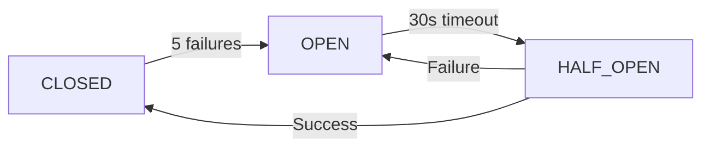

# DNS Service Technical Architecture

> Version: 1.0.0
> Last Updated: September 29, 2025

## Table of Contents

1. [System Overview](#system-overview)
2. [Architecture Components](#architecture-components)
3. [Service Layer](#service-layer)
4. [Data Layer](#data-layer)
5. [Queue System](#queue-system)
6. [Caching Strategy](#caching-strategy)
7. [Error Handling & Resilience](#error-handling--resilience)
8. [Performance Monitoring](#performance-monitoring)
9. [Security Considerations](#security-considerations)
10. [Deployment Architecture](#deployment-architecture)

## System Overview

The DNS filtering system is built as a modular, resilient architecture that provides real-time domain availability checking for generated business names. The system is designed to handle high throughput, provide graceful degradation, and maintain performance under varying load conditions.

### Key Design Principles

- **Asynchronous Processing**: DNS checks run in background queues to maintain UI responsiveness
- **Graceful Degradation**: System continues functioning even when DNS services are unavailable
- **Intelligent Caching**: Multi-layer caching strategy minimizes external DNS queries
- **Circuit Breaker Pattern**: Automatic failover and recovery from service failures
- **Performance Monitoring**: Real-time metrics and health monitoring
- **Horizontal Scalability**: Queue-based architecture supports multiple workers

## Architecture Components

### High-Level Architecture Diagram

```
┌─────────────────────────────────────────────────────────────────┐
│                        Frontend Layer                           │
├─────────────────────────────────────────────────────────────────┤
│  Livewire Components  │  Progressive Enhancement  │  Real-time   │
│  (Name Results)       │  (DNS Status Updates)     │  Updates     │
└─────────────────────────────────────────────────────────────────┘
                                    │
┌─────────────────────────────────────────────────────────────────┐
│                      Application Layer                          │
├─────────────────────────────────────────────────────────────────┤
│  Domain Check Service  │  AI Generation Service   │  Session     │
│  (Orchestration)       │  (Name Generation)        │  Management  │
└─────────────────────────────────────────────────────────────────┘
                                    │
┌─────────────────────────────────────────────────────────────────┐
│                       DNS Service Layer                         │
├─────────────────────────────────────────────────────────────────┤
│ DNS Lookup Service │ Circuit Breaker │ Performance Monitor     │
│ Health Check       │ Recovery Service │ Degradation Service     │
│ Logging Service    │ Alert Service    │ Cache Optimization     │
└─────────────────────────────────────────────────────────────────┘
                                    │
┌─────────────────────────────────────────────────────────────────┐
│                        Queue System                             │
├─────────────────────────────────────────────────────────────────┤
│  DNS Check Jobs    │  Health Monitor Jobs  │  Retry Mechanism   │
│  (Background)      │  (Periodic)           │  (Automatic)       │
└─────────────────────────────────────────────────────────────────┘
                                    │
┌─────────────────────────────────────────────────────────────────┐
│                         Data Layer                              │
├─────────────────────────────────────────────────────────────────┤
│ DNS Cache          │ Performance Metrics   │ Health Status      │
│ (24hr TTL)         │ (Time-series)         │ (Real-time)        │
└─────────────────────────────────────────────────────────────────┘
                                    │
┌─────────────────────────────────────────────────────────────────┐
│                    External DNS Providers                       │
├─────────────────────────────────────────────────────────────────┤
│  Primary DNS       │  Fallback DNS         │  Authoritative     │
│  (8.8.8.8)         │  (1.1.1.1)            │  Servers           │
└─────────────────────────────────────────────────────────────────┘
```

## Service Layer

### Core Services

#### DnsLookupService
Primary service for DNS resolution with caching and error handling.

```php
interface DnsLookupServiceInterface
{
    public function checkDomain(string $domain): DnsLookupResult;
    public function batchCheckDomains(array $domains): array;
    public function clearCache(?string $domain = null): bool;
}
```

**Key Features:**
- Net_DNS2 integration for reliable DNS queries
- Automatic record type detection (A, AAAA, CNAME, MX, NS)
- Intelligent caching with TTL management
- Timeout and error handling
- Support for fallback DNS servers

#### DnsCircuitBreakerService
Implements circuit breaker pattern for DNS service resilience.

```php
class DnsCircuitBreakerService implements DnsLookupServiceInterface
{
    // States: CLOSED, OPEN, HALF_OPEN
    public function checkDomain(string $domain): DnsLookupResult;
    private function recordFailure(): void;
    private function recordSuccess(): void;
    public function isOpen(): bool;
    public function forceClose(): void;
}
```

**Configuration:**
- Failure threshold: 5 consecutive failures
- Recovery timeout: 30 seconds
- Half-open test requests: 1 request

#### DnsPerformanceMonitorService
Real-time performance metrics collection and analysis.

```php
interface DnsPerformanceMonitorInterface
{
    public function startBatch(string $batchId): string;
    public function completeBatch(): ?DnsLookupMetrics;
    public function recordLookup(float $processingTime, bool $success): void;
    public function getAggregatedStats(int $minutes = 60): array;
}
```

**Metrics Collected:**
- DNS lookup response times
- Success/failure rates
- Cache hit rates
- Queue processing times
- Batch processing metrics

#### DnsHealthCheckService
Comprehensive health monitoring and alerting system.

```php
class DnsHealthCheckService
{
    public function performHealthCheck(): array;
    public function getHealthStatus(): array;
    private function evaluateHealth(array $metrics): array;
    private function processAlerts(array $healthStatus): void;
}
```

**Health Indicators:**
- Error rate thresholds (warning: >10%, critical: >25%)
- Response time thresholds (warning: >2s, critical: >5s)
- Cache hit rate thresholds (warning: <70%, critical: <50%)
- Circuit breaker status

### Supporting Services

#### DnsRecoveryService
Automated recovery procedures for DNS service restoration.

**Recovery Steps:**
1. Clear stale cache entries (>24 hours)
2. Reset circuit breakers to closed state
3. Verify DNS server connectivity
4. Warm cache with popular domains
5. Clean old performance metrics
6. Test DNS resolution with sample domains

#### DnsDegradationService
Graceful degradation when DNS services are unavailable.

**Degradation Strategies:**
- **Optimistic**: Assume domains are available
- **Pessimistic**: Assume domains are taken
- **Cache-only**: Use only cached results
- **Disabled**: No DNS filtering applied

#### DnsHealthAlertService
Alert notification system with suppression and webhooks.

**Alert Channels:**
- Application logs (configurable levels)
- Webhook notifications (configurable URLs)
- Alert suppression (prevents spam)

## Data Layer

### Database Tables

#### dns_lookup_cache
Stores DNS lookup results for performance optimization.

```sql
CREATE TABLE dns_lookup_cache (
    id BIGINT PRIMARY KEY AUTO_INCREMENT,
    domain VARCHAR(255) NOT NULL,
    has_records BOOLEAN NOT NULL,
    record_types JSON,
    response_time_ms INTEGER,
    cached_at TIMESTAMP,
    expires_at TIMESTAMP,
    created_at TIMESTAMP,
    updated_at TIMESTAMP,
    INDEX idx_domain (domain),
    INDEX idx_expires_at (expires_at)
);
```

#### dns_lookup_metrics
Performance and operational metrics storage.

```sql
CREATE TABLE dns_lookup_metrics (
    id BIGINT PRIMARY KEY AUTO_INCREMENT,
    batch_id VARCHAR(100),
    domains_checked INTEGER DEFAULT 0,
    successful_lookups INTEGER DEFAULT 0,
    failed_lookups INTEGER DEFAULT 0,
    average_lookup_time DECIMAL(8,2),
    total_processing_time DECIMAL(8,2),
    cache_hits INTEGER DEFAULT 0,
    cache_misses INTEGER DEFAULT 0,
    created_at TIMESTAMP,
    updated_at TIMESTAMP,
    INDEX idx_batch_id (batch_id),
    INDEX idx_created_at (created_at)
);
```

#### name_suggestions (Enhanced)
Extended with DNS-specific fields.

```sql
ALTER TABLE name_suggestions ADD COLUMN dns_checked BOOLEAN DEFAULT FALSE;
ALTER TABLE name_suggestions ADD COLUMN dns_has_records BOOLEAN NULL;
ALTER TABLE name_suggestions ADD COLUMN dns_checked_at TIMESTAMP NULL;
ALTER TABLE name_suggestions ADD INDEX idx_dns_checked (dns_checked);
ALTER TABLE name_suggestions ADD INDEX idx_dns_has_records (dns_has_records);
```

### Cache Strategy

#### Layer 1: Laravel Cache
- **Driver**: Redis (production) / File (development)
- **TTL**: 1 hour for DNS results
- **Key Pattern**: `dns:lookup:{domain}`
- **Size Limit**: 1000 entries per domain type

#### Layer 2: Database Cache
- **TTL**: 24 hours for DNS results
- **Cleanup**: Automatic via scheduled job
- **Indexing**: Optimized for domain and expiration queries

#### Layer 3: Application Memory
- **Scope**: Request-level caching
- **Purpose**: Avoid duplicate queries within single request
- **Implementation**: Service-level static arrays

## Queue System

### Job Architecture

#### CheckDomainDnsJob
Primary background job for DNS resolution.

```php
class CheckDomainDnsJob implements ShouldQueue
{
    use InteractsWithQueue, Queueable, SerializesModels;

    public int $timeout = 30;
    public int $tries = 3;
    public int $maxExceptions = 2;
    public int $backoff = 5;

    public function handle(
        DnsLookupServiceInterface $dnsService,
        DnsPerformanceMonitorInterface $performanceMonitor
    ): void;
}
```

**Queue Configuration:**
- **Queue Name**: `dns` (dedicated queue)
- **Timeout**: 30 seconds per job
- **Retries**: 3 attempts with exponential backoff
- **Rate Limiting**: 50 jobs per minute

#### DnsHealthMonitorJob
Periodic health check job for system monitoring.

```php
class DnsHealthMonitorJob implements ShouldQueue
{
    public function handle(DnsHealthCheckService $healthCheck): void
    {
        $healthStatus = $healthCheck->performHealthCheck();
        // Process alerts and notifications
    }
}
```

**Scheduling**: Every 5 minutes via Laravel Scheduler

### Queue Workers

#### Production Configuration
```bash
# Supervisor configuration for DNS workers
php artisan queue:work --queue=dns --tries=3 --timeout=30 --memory=512
```

**Worker Scaling:**
- **Minimum Workers**: 2 per server
- **Maximum Workers**: 8 per server
- **Auto-scaling**: Based on queue depth
- **Memory Limit**: 512MB per worker

## Error Handling & Resilience

### Circuit Breaker Implementation

#### States and Transitions



#### Configuration
```php
'circuit_breaker' => [
    'enabled' => true,
    'failure_threshold' => 5,
    'recovery_timeout' => 30,
    'half_open_max_calls' => 1,
],
```

### Retry Strategies

#### Exponential Backoff
- **Initial Delay**: 5 seconds
- **Multiplier**: 2x per retry
- **Maximum Delay**: 60 seconds
- **Jitter**: ±20% random variation

#### DNS Server Fallbacks
1. **Primary**: Google DNS (8.8.8.8, 8.8.4.4)
2. **Secondary**: Cloudflare DNS (1.1.1.1, 1.0.0.1)
3. **Tertiary**: System default DNS servers

### Error Categories

#### Recoverable Errors
- Network timeouts
- DNS server unavailability
- Temporary resolution failures
- Rate limiting responses

**Actions**: Retry with exponential backoff

#### Non-Recoverable Errors
- Invalid domain format
- Malformed DNS responses
- Authorization failures
- Circuit breaker open state

**Actions**: Log error, mark as failed, no retry

## Performance Monitoring

### Real-time Metrics

#### System Health Dashboard
```php
[
    'overall_status' => 'healthy', // healthy|warning|critical
    'error_rate' => [
        'current' => 2.5,          // percentage
        'threshold_warning' => 10,
        'threshold_critical' => 25,
        'status' => 'healthy'
    ],
    'response_time' => [
        'average_ms' => 850,
        'p95_ms' => 1200,
        'threshold_warning' => 2000,
        'threshold_critical' => 5000,
        'status' => 'healthy'
    ],
    'cache_hit_rate' => [
        'percentage' => 85.2,
        'threshold_warning' => 70,
        'threshold_critical' => 50,
        'status' => 'healthy'
    ]
]
```

#### Performance Benchmarks
- **DNS Lookup Time**: <2 seconds (average)
- **Cache Hit Rate**: >80%
- **Error Rate**: <5%
- **Queue Processing**: <10 seconds delay
- **Memory Usage**: <512MB per worker
- **Concurrent Lookups**: 100+ simultaneous

### Alerting Thresholds

#### Warning Level
- Error rate >10%
- Response time >2 seconds
- Cache hit rate <70%
- Queue depth >100 jobs

#### Critical Level
- Error rate >25%
- Response time >5 seconds
- Cache hit rate <50%
- Queue depth >500 jobs
- Circuit breaker open for >5 minutes

## Security Considerations

### DNS Query Security

#### Input Validation
```php
private function validateDomain(string $domain): bool
{
    // Maximum length check
    if (strlen($domain) > 253) return false;

    // Valid character pattern
    if (!preg_match('/^[a-z0-9.-]+$/i', $domain)) return false;

    // Valid structure check
    return filter_var('http://' . $domain, FILTER_VALIDATE_URL) !== false;
}
```

#### DNS Injection Prevention
- Parameterized DNS queries
- Domain name sanitization
- Response validation
- Timeout enforcement

### Rate Limiting

#### Per-IP Limits
- **DNS Checks**: 100 per minute
- **Burst Allowance**: 200 per hour
- **Daily Limit**: 10,000 per day

#### Global Limits
- **Total Queries**: 10,000 per minute
- **External DNS**: 1,000 per minute per server
- **Cache Writes**: 5,000 per minute

### Data Protection

#### Logging Policies
- **DNS Queries**: Logged for 7 days (debugging)
- **Personal Data**: No personal information in DNS logs
- **Performance Data**: Aggregated only, no individual queries
- **Error Data**: Sanitized error messages only

#### Encryption
- **Transit**: TLS for all external DNS queries
- **At Rest**: Database encryption for cached results
- **Internal**: Secure internal communication

## Deployment Architecture

### Production Environment

#### Infrastructure Requirements
- **Application Servers**: 2+ instances (load balanced)
- **Queue Workers**: 4+ dedicated worker processes
- **Database**: MySQL 8.0+ with read replicas
- **Cache**: Redis cluster for high availability
- **Monitoring**: Metrics collection and alerting

#### Resource Allocation
```yaml
dns_workers:
  memory_limit: 512MB
  timeout: 30s
  processes: 4
  max_jobs_per_process: 1000

cache:
  redis_memory: 2GB
  max_connections: 100
  persistence: RDB snapshots

database:
  connection_pool: 50
  query_timeout: 10s
  slow_query_log: enabled
```

### Docker Configuration

#### DNS Service Container
```dockerfile
FROM php:8.4-fpm
RUN docker-php-ext-install pdo_mysql redis
COPY . /var/www/html
WORKDIR /var/www/html
CMD ["php", "artisan", "queue:work", "--queue=dns"]
```

#### Environment Variables
```bash
# DNS Configuration
DNS_PRIMARY_SERVER=8.8.8.8
DNS_SECONDARY_SERVER=1.1.1.1
DNS_TIMEOUT_SECONDS=5
DNS_CIRCUIT_BREAKER_ENABLED=true

# Cache Configuration
REDIS_DNS_TTL=3600
DNS_CACHE_MAX_ENTRIES=10000

# Queue Configuration
QUEUE_DNS_WORKERS=4
QUEUE_DNS_TIMEOUT=30
```

### Monitoring and Observability

#### Health Check Endpoints
- `/health/dns` - DNS service health
- `/health/cache` - Cache system status
- `/health/queue` - Queue processing status
- `/metrics/dns` - Performance metrics

#### Logging Configuration
```php
'dns' => [
    'driver' => 'daily',
    'path' => storage_path('logs/dns.log'),
    'level' => 'info',
    'days' => 7,
],
```

#### Metrics Collection
- **Application Metrics**: Laravel Telescope
- **System Metrics**: Prometheus + Grafana
- **Error Tracking**: Sentry integration
- **Performance Monitoring**: New Relic / DataDog

## API Integration

### Internal APIs

#### DNS Check API
```php
POST /api/internal/dns/check
{
    "domains": ["example.com", "test.io"],
    "options": {
        "cache": true,
        "async": true
    }
}
```

#### Health Status API
```php
GET /api/internal/dns/health
{
    "status": "healthy",
    "metrics": { /* performance data */ },
    "last_check": "2025-09-29T12:00:00Z"
}
```

### External Dependencies

#### DNS Providers
- **Primary**: Google Public DNS (8.8.8.8)
- **Fallback**: Cloudflare DNS (1.1.1.1)
- **Protocol**: DNS over HTTPS (DoH) support
- **Monitoring**: Health checks every 60 seconds

## Maintenance and Operations

### Scheduled Tasks

#### Daily Maintenance
```php
// Clear expired cache entries
php artisan dns:cache:cleanup

// Generate performance reports
php artisan dns:metrics:report

// Validate DNS server connectivity
php artisan dns:servers:test
```

#### Weekly Maintenance
```php
// Optimize cache performance
php artisan dns:cache:optimize

// Archive old metrics
php artisan dns:metrics:archive

// Security audit
php artisan dns:security:audit
```

### Troubleshooting Commands

#### Artisan Commands
```bash
# DNS service recovery
php artisan dns:recover [--emergency] [--status]

# Cache management
php artisan dns:cache:clear [domain]
php artisan dns:cache:warm [--popular]

# Health monitoring
php artisan dns:health:check
php artisan dns:health:report

# Performance testing
php artisan dns:test:performance
php artisan dns:test:load [--concurrent=10]
```

### Backup and Recovery

#### Data Backup
- **DNS Cache**: Daily Redis snapshots
- **Metrics**: Weekly database backups
- **Configuration**: Git-based version control

#### Disaster Recovery
1. **Service Restart**: Automatic recovery procedures
2. **Cache Rebuild**: Popular domain cache warming
3. **Fallback Mode**: Graceful degradation activation
4. **Manual Recovery**: Step-by-step recovery procedures

## Future Enhancements

### Planned Improvements

#### Performance Optimizations
- DNS over HTTPS (DoH) implementation
- Geographic DNS server selection
- Advanced caching algorithms
- Machine learning for cache prediction

#### Feature Additions
- International domain support (IDN)
- Additional DNS record types
- Custom DNS server configuration
- Bulk domain validation API

#### Monitoring Enhancements
- Predictive failure detection
- Automated scaling recommendations
- Cost optimization analytics
- User experience metrics

## Conclusion

The DNS service architecture provides a robust, scalable, and maintainable solution for real-time domain availability checking. The system is designed to handle high load, provide graceful degradation, and maintain excellent performance while ensuring reliability and security.

For questions or contributions to the DNS service architecture, please refer to the development team or consult the additional technical documentation in the `/docs` directory.